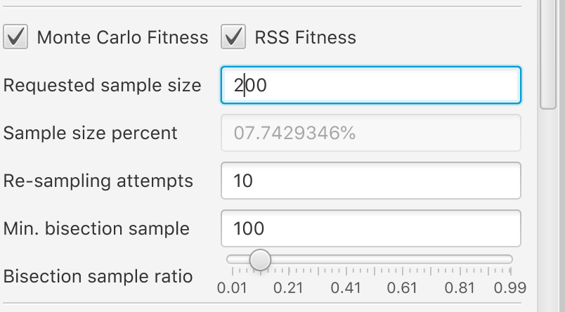

# **Symbolic fitting of SCOTSv2.0 BDD controllers**

**Author:** [Dr. Ivan S. Zapreev](https://nl.linkedin.com/in/zapreevis)

**Project pages:** [Git-Hub-Project](https://github.com/ivan-zapreev/SCOTS2SR)

## **Introduction**

This software is a Java-based UI tool for symbolic fitting of the [BDD-based](https://en.wikipedia.org/wiki/Binary_decision_diagram) controllers as produced by `SCOTSv2.0` - a tool to compute [discrete abstractions and symbolic controllers](<https://gitlab.lrz.de/matthias/SCOTSv0.2>).

Our software uses Symbolic Regression, powered by Genetic Programming and realized by the [SR2JLIB library](https://github.com/ivan-zapreev/SR2JLIB), to fit the controller's data with functions. As a result, a deterministic vector function is generated representing the control law determinization of the original, possibly non-deterministic, BDD-based controller.

This software is useful in generating functional controllers for embedded platforms which do not allow for importing BDD libraries (in our case the [CUDD library](http://davidkebo.com/cudd). Since, by using functional representation, memory required for storing a control law can be drastically reduced, this tool is handy for platforms having limited memory resources.

Symbolic regression is known to easily provide a very good fit of data, whereas it is very hard for it to get an absolute (`100%`) fit. This is caused by the random nature of the process. Therefore, the found functional controller will most likely not be completely fit meaning that its actual domain will be somewhat smaller than that of the original one. This is however not an issue at all. The functional controller's domain can be recomputed and the way of doing this is described in the upcoming sections of the document.

## **Dependencies**

This project is dependent on:

1. Java Symbolic Regression Library - [SR2JLIB](https://github.com/ivan-zapreev/SR2JLIB)
2. JNI interface for the fitness-computing backend - [SCOTS2JNI](https://github.com/ivan-zapreev/SCOTS2JNI)
2. Fitness computing backend itself (indirectly by loading of its dynamic library) - [SCOTS2DLL](https://github.com/ivan-zapreev/SCOTS2DLL)

## **Required tools**

In order to build the project one requires to have:

1. Netbeans version 8.2 or later in its version containing: Java/JDK and C++
2. JDK version 1.8 or later

## **Build instructions**

Before the project can be build `SR2JLIB`, `SCOTS2JNI`, and `SCOTS2DLL ` are to be downloaded and build in the folders next the the folder containing this project.

The directory structure is assumed to be as follows:

```
$ ls -al
drwxr-xr-x  10 user  staff   320 May 15 10:22 .
drwxr-xr-x   8 user  staff   256 Feb 20 08:41 ..
drwxr-xr-x  12 user  staff   384 May 15 15:36 SR2JLIB
drwxr-xr-x  13 user  staff   416 May 15 16:14 SCOTS2DLL
drwxr-xr-x   8 user  staff   256 May  7 12:12 SCOTS2JNI
drwxr-xr-x  13 user  staff   416 May 15 16:15 SCOTS2SR
...
```
Where `SCOTS2SR` is storing this project. Further one needs to:

1. Build `SR2JLIB` following [the instructions](https://github.com/ivan-zapreev/SR2JLIB)
2. Build `SCOTS2JNI` following [the instructions](https://github.com/ivan-zapreev/SCOTS2JNI)
3. Build `SCOTS2DLL` following [the instructions](https://github.com/ivan-zapreev/SCOTS2DLL)

Further one requires to

1. Open the `SCOTS2SR ` project in Netbeans
2. Initiate the project `build` from the Netbeans IDE
3. Run the project from within the Netbeans IDE

## **Tool's configuration**
The tool's configuration properties are stores in the `config.properties` file located in the project folder. These are updated each time the tool exits.

In order to re-set the properties to the *default* ones it suffices to delete the `config.properties` file.

Each time the tool is started it loads the dynamic native library produced by `SCOTS2DLL`. If the library can not be found or can not be loaded an error message is displayed, followed by the *File Open Dialog* in which the user is supposed to select the location of the `SCOTS2DLL`'s project dynamic library. The details on why the library could not be loaded, can be found in the Netbeans console log. The proper library location is stored in `config.properties` along with other parameters. Therefore typically, choosing the proper library is needed only the first time the tool is started.

## **Tool's interface**
The main tool's interface is depicted in the figure below:


### The top panel


Contains the main control buttons for:

*  *Load* - to load the BDD controller
*  *Run* - run the symbolic regression for the loaded controller
*  *Stop* - stop the symbolic regression run
*  *Save* - export the generated functional controller

This panel is also used for displaying progress bars, when needed.

### The bottom panel


Contains the main UI log which allow one to monitor the tool's status. Advanced status details can be obtained by monitoring the log files. The latter is explained in the subsequent sections.

### The left panel
Is used for configuration options and is split into two tabs.


The first one contains various tool options, including those that influence the symbolic regression.


The second one is fully devoted to the grammar to be used when generating the controllers. For the details on the possibilities for the grammar please refer to [SR2JLIB](https://github.com/ivan-zapreev/SR2JLIB/).

### The right panel


Is devoted to monitoring the population grid and fitness values, for both *actual* and *extended fitness*. If the latter is devoted then the interface adjusts by hiding the *extended fitness* related UI component.


## **Loading controllers**
In order to load a controller, one has to click on the **Load** button and select a pre-generated SCOTSv2.0 `*.scs` (with an accompanying BDD) controller file. Once the file is selected the fitness checking back-end `SCOTS2DLL` starts loading the BDD controller.


Loading the controller can take a rather long time, and is fully controlled by `SCOTSv2.0`/`CUDD`. Once the controller is loaded one is to choose its state space dimensionality. The latter must be known to the user of the tool, and or the one who generated the controller, and can not be guessed by the tool itself, as it can not be derived from the controller's file.


Once the state-space dimensionality is chosen, things such *Sample size percentage* (for Monte-Carlo fitness) are computed and the symbolic regression itself can be started.



## **Monitoring logs**

The main UI logging is done in the bottom part of the UI, in the dedicated logging panel. However, for each loaded controller there are two more logs available, which are created in the same folders where the original BDD controller files are present.

Assuming a BDD controller file: `<path>/<name>.scs` the `<path>/<name>.gp.log` file will be generated by the Java part of the tooling (`SCOTS2SR`, `SCOTS2JNI`, and `SR2JLIB`) and the `<path>/<name>.sr.log` file will be generated by the C++ fitness-checking part of the tooling (`SCOTS2DLL`).

## **Fitting controllers**

Fitting the BDD controller with function can be started by clicking the **Run** button in the tool's top panel. After that, the tool performs the following steps:

* **Configures the fitness checking back-end** (the dynamic library produced by `SCOTS2DLL` project). This process includes extracting the controller from the BDD into an explicit format, as accessing the data from a BDD is very costly. So this step can take a very long time, depending on the controller's size. The extraction process can be monitors through the corresponding `<path>/<name>.sr.log` file.
* **Creates and prepares the Grammar objects.** That includes analysis of the provided grammar in turns of its completeness and consistency. This process includes computing the grammar's minimum depth values, which is a recursive process limited by the value of the *"Max. grammar depth"* parameter:


If the grammar's minimum depth can not be found within the given *"Max. grammar depth"* then an error is issued:


This means one of the two: *(i)* the grammar is not properly defined and some non-terminals can not be expanded to finite expressions; *(ii)* the *"Max. grammar depth"* is insufficiently large and has to be increased. The latter is very unlikely, given the default *"Max. grammar depth"* value of `1000`.
* **The Grammar is configured and prepared.** That step includes propagation placement nodes, computing the (non-)terminal probabilities and etc. is typically very fast.
* **The Process Manager is instantiated and configured.** Here, the main instance of the symbolic regression manager is created and being prepared to run genetic operations.
* **The Symbolic Regression is started.** First, the initial population is seeded on the greed and then the breeding process begins. The maximum, mean and deviation values of the fitness are started to be shown on the plots as well as the population grid views start being updated:


Note that, the population breeding is done in parallel by running the number of parallel tournament selections and reproductions in the different areas of the population grid. The number of parallel processes id defined by the grid size, the number of parallel breeding threads:


and the child spread (the area around the reproduced individual that is locked due to planting its offsprings) parameters:


### Duration of Symbolic Regression

The length of the symbolic regression process depends on the following *"run-length"* parameters:


* Enabling *"Endless iterations"* means that there is no limit on the number of times individuals will be let to reproduce. In this case, if *"Stop is found"* is not enabled, the symbolic regression will run *"forever"*, until it is stopped manually by pressing the **Stop** button.
* Enabling *"Stop is found"* will result in that, as soon as at least one `100%` fit individual is found, the symbolic regression is stopped.
* If *"Endless iterations"* are disabled then the number of individual reproduction cycles is limited by the *"Reproductions"* parameter value. Note that, a single reproduction of an individual results in multiple offsprings thereof. Moreover, not all of the offsprings will find their place on the grid, i.e. will survive. The latter is defined by the outcome of the local tournament selection with the individuals surrounding the parent individual on the grid. So the *"mutants count"* (horizontal axis) values of the *fitness* plots indicate the total count of individuals successfully settled on the grid during the symbolic regression process. The latter means that *"Reproductions"* and *"mutants count"* are correlated but do not have an identical meaning.

## **Exporting controller**
Once symbolic regression is finished or stopped one can either re-start it or export the produced controllers:


The latter is done by clicking the **Save** button in the tool's top panel and thought the *"File save"* dialog selecting where to store the data. The resulting controller is split into two parts:

* `<path>/<name>.sym` - the functional part of the controller stored as a text file
* `<path>/<name>.unfit.scs` and `<path>/<name>.unfit.bdd` - the BDD part storing the unfit states from the original controller's domain.

The former stores the controller's overall fitness percentage and, per input-space dimension, the function representing the discrete controller:


The way the controller can be used is explained in the next section in all necessary details, below let us list the steps performed by the application to store the controller:

* The list of individuals with the maximum *"Actual fitness"* is obtained
* If the *"Reduce symbolic controller size on save"* option is set:


then the best fit individuals get their size optimized. The latter is a simple procedure trying to reduce size of constant expressions in the controller's functions. Depending on the number and complexity of the best fit individuals, this can take a rather long time but can be easily monitored through the tool's UI log and the progress indicator:


* The *"smallest expression size"* individual is selected based on the size of the text size to represent the individual's input-space functions.
* The chosen function controller is sent to the fitness computing back-end (`SCOTS2DLL`) in order to evaluate its complete fitness and sore the unfit domain points into the file. Note that this can take a long time as requires evaluating the function controller on all domain points. However the process can be easily monitored through the corresponding original controller's log file `<path>/<name>.sr.log`.
* Once the unfit points have been exported the function controller is stored into the `<path>/<name>.sym` file along with its fitness value. The latter is also shown in the tool's UI dialog:


  
## **Using functional controllers**

This section is split into two parts. First, since the functional controller fitness will most likely be less than `100%` we will discuss a way to find the sub-domain of the original controller on which the functional controller will be `100%` correct. Second, we will explain how the functional controller can be used in the controlling software to produce input signals. The latter will include discretization and de-discretization steps.

### Computing the functional controller's domain

Please note that, the functional controller's domain is generally speaking the subset of the original one. In order to compute the functional controller's domain one must:

1. Take the unfit states exported by the tool (the `<path>/<name>.unfit.scs` and `<path>/<name>.unfit.bdd` file)
2. Extend the original property `F` used to generate the controller in `SCOTSv2.0` and extend it as `F && G!<unfit>` where `G` is the *"globally"* operator *"!"* is negation and *"<unfit>"* is the set of unfit points exported.
3. Then `SCOTSv2.0` must be used to generate the new controller for `F && G!<unfit>`.
4. The domain of the newly produced controller will be the set of state on which the functional controller for the original property `F` will be `100%` correct.

### Using the functional controller in controlling software

The exported function controller is the controller that is expecting to get the discrete grid cell indexes per state-space dimension as inputs and as a result it will output double values, per output dimension, that after applying `round(abs(.))` to them will be valid grid cell indexes for the output dimensions. 

In other words, the process of using the controller shall be as follows:

1. The *"continuous-space"* state vector is to be transformed into the *"abstract-space"* state vector consisting, in each dimension, of the corresponding grid interval index. To perform this transformation, the discretization parameters employed in `SCOTSv2.0` to produce the original controller must be used. Please note that in each dimension, SCOTS discretizes the state space using the right-half-open intervals  `[x_1, x_2),[x_2, x_3), ... [x_(n-1), x_n]` with their center point indexes starting with `0`. I.e. the `[x_1, x_2)` interval's center point has index `0` and the `[x_(n-1), x_n]` interval's center point has index `n-1`. The length of each interval is the value of the discretization parameter.
2. The *"abstract-space"* state vector is to be used to valuate the `y_i` arguments of the controller functions stored in `<path>/<name>.sym`. Please note that the index of the argument variables `y_i` starts from `0`.
3. The result of the controller's function evaluation, in each dimension is to be mapped to into the *"abstract-space"* input vector by applying `round(abs(.))` to it.
4. The resulting *"abstract-space"* input vector is to be transformed into the *"continuous-space"* input vector by reverting the discretization process of SCOTS (the input space is discretized the same way the state space is). The latter can be done by computing the corresponding grid cell's center point vector using the input-space discretization parameters employed in `SCOTSv2.0` to produce the original controller.

## **Frequently Asked Questions**
Below you will find the list of the frequently asked questions with our answers to them:

> Can I use the tool on Windows platforms?

* That would be possible if CUDD would be portable to Windows. For now we provide no support for Windows platforms, not even under [Cygwin](https://www.cygwin.com/).

> What does it mean when the average fitness is above the maximum one?

* This is caused by numerical errors in mean computations. Nothing to worry about, this might be fixed in the future releases. For now it is important to remember that the main fitness indicator is the maximum of the *"actual fitness"* value.

> When do I stop my symbolic regression run?

* Unless the maximum iterations count is set to a concrete value the regression will run forever, unless a 100% individual is found. The latter is a rare occasion so in principle one can stop symbolic regression at any time. The less fit is the functional controller the smaller will be the domain it is valid for. However the rule of thumb is iterate until the average fitness values flatten out and stop growing. This indicates the convergence of regression the some local maximum.

> How is it possible that the actual fitness can drop?

* In general if there is just *"actual fitness"* enabled (no *"extended fitness"* is used) this should not be happenings, unless it is a software bug. However, if *"extended fitness"* is enabled then individuals are compared based on it and this can cause an individual having higher *"extended fitness"* to remove an individual with a higher *"actual fitness"* from the grid. Typically the situation is restored and the *"actual fitness"* values are re-gained as the growing *"extended fitness"* pulls the *"actual fitness"* up over time.

